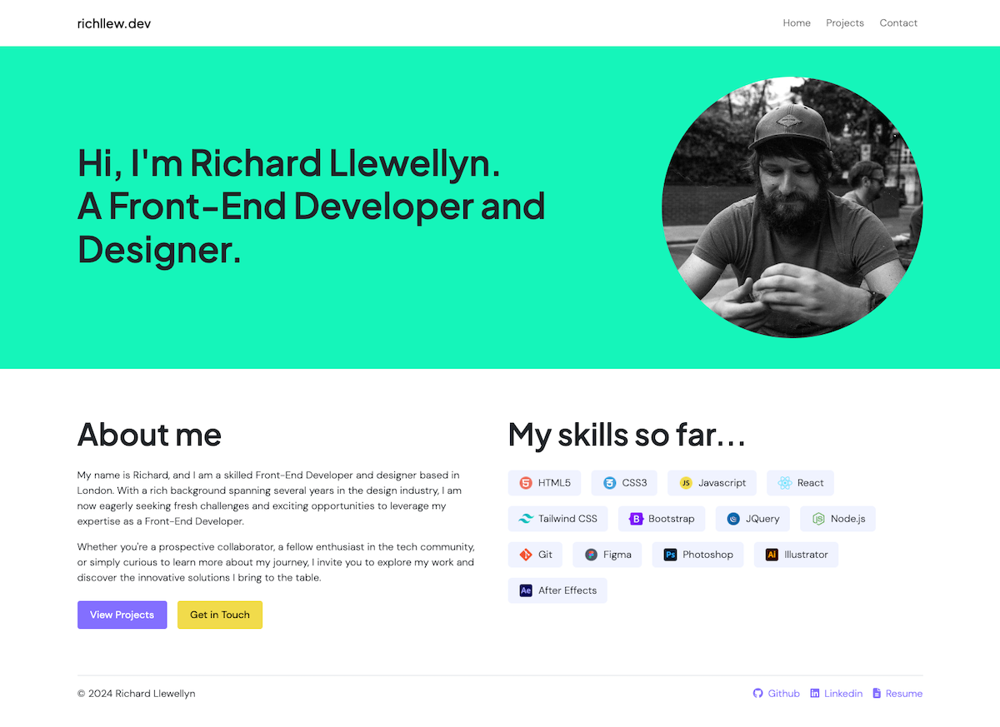

# React Portfolio
Module 13 Challenge for EDX Bootcamp

<!-- TABLE OF CONTENTS -->

  
Table of Contents

  <ol>
    <li>
      <a href="#description">Description</a>
      <ul>
        <li><a href="#built-with">Built With</a></li>
      </ul>
    </li>
    <li>
        <a href="#installation">Installation</a>
    </li>
    <li><a href="#usage">Usage</a></li>
    <li><a href="#license">License</a></li>
    <li><a href="#contact">Contact</a></li>
    <li><a href="#acknowledgments">Acknowledgments</a></li>
  </ol>

<!-- ABOUT THE PROJECT -->
## Description

This was the 13th homework challenge for the EDX Bootcamp in Front End Development.
 

Our task was to rebuild our online portfolio using React components and functions.

### Built With

* 
* 
* 
* 
* 
* 
* 

## Installation

N/A

<!-- USAGE EXAMPLES -->
## Usage

To preview this app, users can create a clone of the repo in their local environment. They can then open the folder in an integrated terminal and run the following command:

~~~ssh 
npm i 
~~~

This will install the relevant node modules. 

The user can then run the following:

~~~ssh 
npm run dev 
~~~

This will generate a local host URL that can be clicked to preview the app. 

To deploy the app to GitHub Pages, the user can enter the following commands:

~~~ssh 
npm run build
npm run deploy 
~~~

On the deployed site users can navigate to the Projects tab, which will display 6 projects that are generated by data stored in a JSON file.

<!-- LICENSE -->
## License

Distributed under the MIT License. See `LICENSE.txt` for more information.

<!-- CONTACT -->
## Contact

Richard Llewellyn - richard.lee.llewellyn@gmail.com 

Project Link: [https://richllew.dev/](https://richllew.dev/)

Project Repo Link: [https://github.com/RichLlew182/react-portfolio](https://github.com/RichLlew182/react-portfolio)

<!-- ACKNOWLEDGMENTS -->
## Acknowledgments

* [Img Shields](https://shields.io)
* [Best README Template](https://github.com/othneildrew/Best-README-Template)